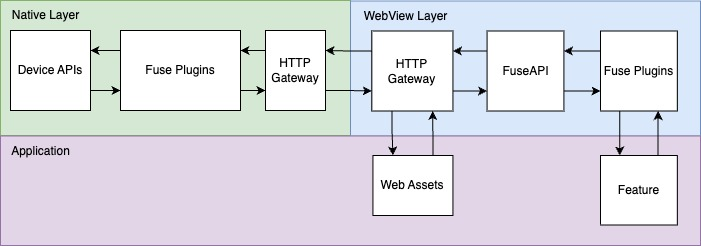

# NBSFuse

A native-first framework for building hybdrid native-web applications.

This framework is entering **alpha** stage, and not intended to be used in production code.

[Documentation]('./docs/main.md) is pending.

JavaScript Requirements:
- ES2018/ES9
- Some kind of bundler (e.g. [Webpack](https://webpack.js.org/))

Supported Platforms:
- Android API 24+
- iOS 14

Supported platforms and requirements are subjected to change without notice.

## What is it?

NBSFuse (referred to as Fuse, or Fuse framework from here on out) is a framework for hybrid native-web building mobile applications.
The Fuse framework takes a "native-first" approach. That is, everything first starts with your native project, whether that be an iOS XCode project, or an Android gradle project.

The Fuse framework is simply a framework that you can import into your project via traditional native dependency management systems, such as
CocoaPods or maven. Unlike other frameworks that generates or manages native projects for you, we do not concern ourselves with your project stucture. In fact, we expect you to start your own native project and import the Fuse as a framework dependency.

## Is it for me?

Well that depends. To use the Fuse framework efficiently, knowledge with both native and web development development will be required.
If native development is not part of your team's skillset, then other hybdrid frameworks might be more suitable.

Otherwise you're probably well adept in native development already, why would you use this framework? Well the Native-Webview glue is already built for you with a plugin API. Everything is designed so that you can write the native code inside the native IDE and have access to native intellisense and other build/project features. Surely one could be written and that may do the job if you're only using a WebView for a one-off page, but if the intent is to build fully features native application with a web-based UI backed by a native API, then this framework is probably for you.

## Architecture

The architecture of the Fuse framework consists of primarily two layers: Native and Webview side, glued by a HTTP protocol API with plugin support to extend functionality where needed.

For iOS, the HTTP API is powered by the [WKURLSchemeHandler](https://developer.apple.com/documentation/webkit/wkurlschemehandler?language=objc) which powers the DOM requests for your web assets, and also powers native APIs.

For Android, the [WebViewAssetLoader](https://developer.android.com/reference/androidx/webkit/WebViewAssetLoader) powers the DOM requests for your web assets, however due to a lack of a [feature](https://issuetracker.google.com/issues/119844519) in the API, we use an embedded HTTP server1 to power the HTTP API

    

 

The key value of using an HTTP based API over the traditional [WKUserContentController](https://developer.apple.com/documentation/webkit/wkusercontentcontroller)/[JavascriptInterface](https://developer.android.com/reference/android/webkit/JavascriptInterface) APIs is speed.
These APIs only supports strings well and with no stream interface, it's hard to send larger datasets, especially binary data in an efficient manner. The HTTP-based API allows you to send strings, but also allows you to stream binary data, as binary data if required.

For example, if you need to fetch a large file, it can be sent to the WebView as an [ArrayBuffer](https://developer.mozilla.org/en-US/docs/Web/JavaScript/Reference/Global_Objects/ArrayBuffer) or [Blob](https://developer.mozilla.org/en-US/docs/Web/API/Blob), and those APIs can be sent as is back to native via the HTTP API. No need to base64 encode into an immutable string to send it across an IPC bridge for to be parsed back into raw binary.

In our testing, a Cordova app with the file plugin installed using the traditional native bridge API can send a 100mb data file to the webview in approximately 2,000ms. With the HTTP API approach, that same 100mb data file can be sent to the webview in approximately 100ms. That's about a 20x improvement on performance.

1 The embedded HTTP server API will be used for as long as [WebResourceRequest](https://developer.android.com/reference/android/webkit/WebResourceRequest) lacks the ability to read the HTTP content body. It is a security concern to have a web server open, and having non-intentional actors requesting or probing the server, or potentially making native API calls on the behalf of the host application. Here are a few ways to minimize the risk of exploits:

1. We do not assign an explicit port. When a FuseContext is created, the HTTP API server will be spawned with a random available port. This not only protects multiple apps from clashing for the same port, but also makes it more difficult to probe for Fuse framework instances.
2. When the HTTP API server is created, a crytographic key is generated. The server will expect this key to be present on every request made, blocking probing from unintentional actors.

#### The Web Environment

The Fuse framework for the most part is rather unopinionated about your web assets. Simply drop in your HTML, css and JS and it can load them up. It does make few assumptions:

1. The `/assets/` path is a reserved path for serving your assets. This path will lead to your app's root asset directory.
2. The `/api/` path is reserved for plugin endpoints.

URL fragment design in general are reserved by the Fuse framework.

Additionally if you want to make use of the Fuse API and use Fuse plugins, you'll need to import `@nbsfuse/core` which is an unbundled JS module.
It would be recommended to incorporate a module bundle that can take NPM modules and bundle them (either in a single file, or a chunked fashion). See the test app for a [webpack configuration example](./testapp/webpack.config.js).
