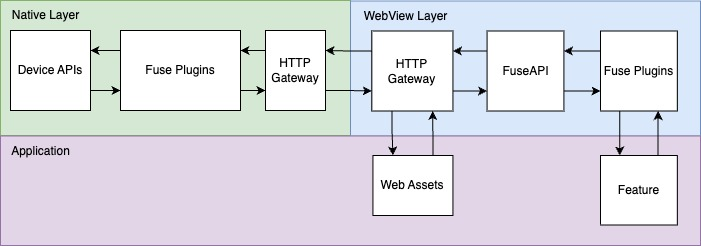

# Fuse

A native-first framework for building hybrid native-web applications.

This framework is entering **alpha** stage, and not intended to be used in production code. See the [Roadmap](https://github.com/orgs/btfuse/discussions/38).

Supported Platforms:

|Platform|Version|
|---|---|
|Android|API 26+2|
|iOS|15+|
|JS|ES8/ES2017|

A bundler (e.g: [Webpack](https://webpack.js.org/)) is required.

Supported platforms and requirements are subjected to change without notice.

For Android, we aim to support the minimum API that the [system webview](https://chromium.googlesource.com/chromium/src/+/refs/heads/main/build/config/android/config.gni#70) supports. However, factory webview versions that ships with API 26 devices will not support all JS features required by this framework. These devices needs to be connected to an App Store to receive the latest webview updates for compatibility.

2 Only API 28+ devices are tested.

## What is it?

Fuse is a framework for hybrid native-web building mobile applications.
The Fuse framework takes a "native-first" approach. That is, everything first starts with your native project, whether that be an iOS XCode project, or an Android gradle project.

The Fuse framework is simply a framework that you can import into your project via traditional native dependency management systems, such as
CocoaPods or maven. Unlike other frameworks that generates or manages native projects for you, we do not concern ourselves with your project stucture. In fact, we expect you to start your own native project and import the Fuse as a framework dependency.

## Is it for me?

Well that depends. To use the Fuse framework efficiently, knowledge with both native and web development development will be required.
If native development is not part of your team's skillset, then other hybrid frameworks might be more suitable.

Otherwise you're probably well adept in native development already, why would you use this framework? Well the Native-Webview glue is already built for you with a plugin API. Everything is designed so that you can write the native code inside the native IDE and have access to native intellisense and other build/project features. Surely one could be written and that may do the job if you're only using a WebView for a one-off page, but if the intent is to build fully featured native application with a web-based UI backed by a native API, then this framework is probably for you.

Let's have a look at the other common platforms that achieves the same goal.

|Capability|Fuse|Cordova|CapacitorJS|
|:---:|:---:|:---:|:---:|
|Android|:white_check_mark:|:white_check_mark:|:white_check_mark:
|iOS|:white_check_mark:|:white_check_mark:|:white_check_mark:|
|Electron|:x:|:white_check_mark:|:white_check_mark:4|
|Plugin Support|:white_check_mark:|:white_check_mark:|:white_check_mark:|
|Modular Plugins|:white_check_mark:|:x:2|:question:|
|Binary Support|:white_check_mark:|:white_check_mark:1|:white_check_mark:1|
|Plugin Ecosystem|Bare|Expansive|Large with some Cordova cross-compatibilty
|Unit Testability|:white_check_mark:|:x:3|:question:

1Cordova & CapacitorJS supports binary via Base64 encoding whereas Fuse
has native binary support.

2Cordova has limited support for distributing plugins as native modules due to their usage of looking up symbols by string. It's not known if CapacitorJS has the same restriction.

3Cordova has an internal `paramedic` tool for unit testing plugins, but plugin projects are typically not housed in a real native project and do not have access to native test tools. It's not known if CapacitorJS have the same limitations. Fuse has access to native test tools as well as your choice of a JS test runner.

4CapacitorJS has a community-driven Electron platform.

## Architecture

The architecture of the Fuse framework consists of primarily two layers: Native and Webview side, glued by a HTTP protocol API with plugin support to extend functionality where needed.

For iOS, web content is served using the [WKURLSchemeHandler](https://developer.apple.com/documentation/webkit/wkurlschemehandler?language=objc) which powers the DOM requests for your web assets.

For Android, the [WebViewAssetLoader](https://developer.android.com/reference/androidx/webkit/WebViewAssetLoader) powers the DOM requests for your web assets.

Due to limitations on both platforms, an embedded HTTP server is used to power an HTTP API. The web environment doesn't have a direct communication link to the native environment, and the existing APIs to transfer data in and out of the environment is incredibly slow. The embedded HTTP server serves that socket gap with the capability of sending large amounts of data, including binary data very efficiently. 

Android lacks the [feature](https://issuetracker.google.com/issues/119844519) to intercept and read HTTP content bodies making it unsuitable for an API since data cannot be passed to native. iOS doesn't support sending binary data over non-https protocols, and the scheme must use a custom, non-standard protocol as the scheme, making it unsuitable for the API since it will Base64 encoding of binary data, which is the primarily bottleneck of the typical JS bridge API.

    

 

The key value of using an HTTP based API over the traditional [WKUserContentController](https://developer.apple.com/documentation/webkit/wkusercontentcontroller)/[JavascriptInterface](https://developer.android.com/reference/android/webkit/JavascriptInterface) APIs is speed.
These APIs only supports strings well and with no stream interface, it's hard to send larger datasets, especially binary data in an efficient manner. The HTTP-based API allows you to send strings, but also allows you to stream binary data, as binary data if required.

For example, if you need to fetch a large file, it can be sent to the WebView as an [ArrayBuffer](https://developer.mozilla.org/en-US/docs/Web/JavaScript/Reference/Global_Objects/ArrayBuffer) or [Blob](https://developer.mozilla.org/en-US/docs/Web/API/Blob), and those APIs can be sent as is back to native via the HTTP API. No need to base64 encode into an immutable string to send it across an IPC bridge for to be parsed back into raw binary.

In our testing, a Cordova app with the file plugin installed using the traditional native bridge API can send a 100mb data file to the webview in approximately 2,000ms. With the HTTP API approach, that same 100mb data file can be sent to the webview in approximately 100ms. That's about a 20x improvement on performance.

### API Server Security

The embedded API server is secured in several ways.

#### Security by Obscurity

The first layer is done by obscurity. The API server is only listened on localhost, on a random available port. This is a requirement to avoid conflicts with potentially other apps running the Fuse framework, as well as making it more difficult for the API server to be discovered or probed.

The application itself contains an API to find the current port.

#### Secret Tokens

The API server will generate a crytographic token which must be present when making API requests. The application itself contains an API to get this token. If the token is not present or correct, the embedded API server will refuse to accept any connections.

#### TLS Enabled

The API Server has TLS enabled using a self-signed certificate and private key generated during application launch. The embedded WebView will trust the certificate that was signed by its own private key.

The generated keypair for TLS is never stored permanently and is used only for the lifetime of the application. On every application launch, a new keypair is generated. While self-signed certificates don't have a trusted CA, this specific self-signed certificates can be trusted since the application itself is the entity that created them. The embedded webview will test and assert the certificate was signed by its current generated private key. This gives the application some confidence that HTTPS is at least encrypting data securely for transit.

Enabling TLS even on localhost connections allows the application to send data from the webview to the API server and vice versa securely, without third-party snooping on the network interfaces.

The embedded API server is a closed system intended for a single client, which is your own application. This is how we can assert trust on a self-signed certificate since the application itself acts as the CA.

#### The Web Environment

The Fuse framework for the most part is rather unopinionated about your web assets. Simply drop in your HTML, css and JS and it can load them up. It does make few assumptions:

1. The `/assets/` path is a reserved path for serving your assets. This path will lead to your app's root asset directory.
2. The `/api/` path is reserved for plugin endpoints.

URL fragment design in general are reserved by the Fuse framework.

Additionally if you want to make use of the Fuse API and use Fuse plugins, you'll need to import `@btfuse/core` which is an unbundled JS module.
It would be recommended to incorporate a module bundle that can take NPM modules and bundle them (either in a single file, or a chunked fashion). See the test app for a [webpack configuration example](https://github.com/btfuse/fuse-test-app).

## License

Copyright 2023-2024 Breautek

Licensed under the Apache License, Version 2.0 (the "License");

For full details, see <a href="http://www.apache.org/licenses/LICENSE-2.0" target="_blank">http://www.apache.org/licenses/LICENSE-2.0</a>
